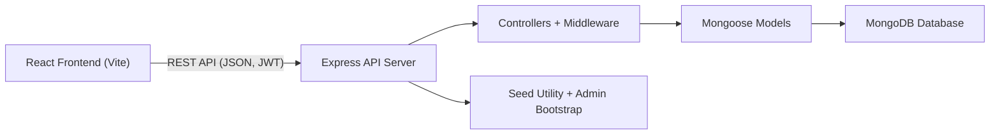

# Thesis: Nagaland Tourism Full-Stack Web Application

## Project Information
- Project title: `Nagaland Tourism Full-Stack App`
- Thesis type: Undergraduate project thesis (implementation-based)
- Project snapshot date: `May 3, 2026`
- Technology stack: `React`, `Vite`, `Node.js`, `Express`, `MongoDB`, `Mongoose`, `JWT`, `bcrypt`

## Abstract
Tourism in Nagaland is rich in culture, ecology, and heritage, but travel planning information is often fragmented across social media pages, booking portals, and local word-of-mouth channels. This project presents a full-stack web application designed to centralize destination discovery, hotel and homestay booking, taxi booking, and restaurant review workflows for travelers interested in Nagaland. The system provides separate user and admin experiences, with secure authentication, role-based authorization, and content management features.

The backend is built using Node.js, Express, and MongoDB with Mongoose schemas for users, tourist places, stays, taxi bookings, hotel bookings, and restaurant reviews. The frontend is developed in React with a responsive interface, page-level state handling, and local storage persistence for theme, wishlist, and itinerary. The application also includes operational enhancements such as startup seeding of core tourism data, automatic creation of an admin account (if absent), and booking expiry design through TTL-based data lifecycle fields.

The implemented solution demonstrates that a region-focused tourism platform can be built with maintainable web technologies while supporting both content exploration and transactional user actions. The project delivers a practical foundation for digital tourism enablement and can be extended with payments, recommendation intelligence, and production-grade observability in future iterations.

Keywords: Nagaland tourism, MERN stack, full-stack web app, travel booking, role-based access, MongoDB.

## Chapter 1: Introduction

### 1.1 Background
Nagaland has high tourism potential across natural landscapes, tribal heritage, festivals, and local cuisine. However, travelers frequently face difficulty in combining reliable place discovery, transport planning, and accommodation booking into a single workflow. Existing solutions are either generic national portals or disconnected local channels.

### 1.2 Problem Statement
There is a need for a unified platform that allows:
- discovery of verified tourist destinations in Nagaland,
- booking of transport and stays with simple flow,
- access to local restaurant information and user reviews,
- content control by administrators without direct database access.

### 1.3 Aim
To design and implement a secure, user-friendly, full-stack tourism web application for Nagaland that integrates destination browsing, booking workflows, and admin-controlled content operations.

### 1.4 Objectives
1. Implement phone-based registration and login with password security.
2. Build role-based authorization for regular users and administrators.
3. Provide tourism discovery interfaces for places, stays, and restaurants.
4. Implement protected taxi and stay booking workflows.
5. Support restaurant review creation by authenticated users.
6. Provide admin CRUD operations for places and hotels/homestays.
7. Seed initial region-specific tourism data into the platform.

### 1.5 Scope
This thesis covers design and implementation of:
- authentication and authorization,
- CRUD and read workflows for tourism entities,
- user experience for planning, wishlist, itinerary, and bookings,
- admin dashboard for catalog management.

Out of scope for this version:
- online payment gateway integration,
- multi-language localization,
- automated unit/integration test suite,
- advanced analytics and recommendation engines.

## Chapter 2: Technology and Design Rationale

### 2.1 Stack Selection Rationale
- `React + Vite` offers fast development iteration and a responsive SPA interface.
- `Node.js + Express` provides lightweight, modular REST API development.
- `MongoDB + Mongoose` supports flexible document modeling for tourism records and nested reviews.
- `JWT` enables stateless authentication across frontend and backend.
- `bcrypt` ensures password hashing with secure comparison.

### 2.2 Domain Data Initialization Strategy
The application uses structured default datasets for places, hotels/homestays, and restaurants. At backend startup, `seedIfEmpty` performs upsert-based population and ensures an admin account exists. Current dataset size in code is:
- tourist places: `18`
- hotels/homestays: `16`
- restaurants: `14`

This strategy reduces setup friction and improves first-run usability.

## Chapter 3: Requirement Analysis

### 3.1 Functional Requirements
1. User registration with phone and strong password validation.
2. User login and admin login with role validation.
3. Profile retrieval, username update, and password change.
4. Public listing and detail access for tourist places.
5. Authenticated taxi booking creation, listing, and cancellation.
6. Public stay listing and authenticated stay booking and cancellation.
7. Restaurant listing and authenticated review submission.
8. Admin creation and deletion of places.
9. Admin creation and deletion of hotels/homestays.
10. Frontend itinerary and wishlist persistence.

### 3.2 Non-Functional Requirements
1. Security: hashed passwords, JWT-protected routes, role checks.
2. Reliability: startup checks for seed data and admin user.
3. Maintainability: route-controller-model separation in backend.
4. Usability: responsive UI with mobile adaptations and clear user feedback.
5. Performance: concurrent API data loading and efficient filtered rendering.

## Chapter 4: System Architecture

### 4.1 High-Level Architecture

### 4.2 Backend Layering
- `app.js`: middleware registration, CORS policy, route mounting, health endpoint.
- `routes/*`: endpoint grouping by domain (`auth`, `places`, `taxis`, `hotels`, `restaurants`).
- `controllers/*`: business logic and request validation.
- `models/*`: schema definitions and data rules.
- `middleware/auth.js`: JWT verification and admin guard.
- `middleware/errorHandler.js`: centralized error responses.
- `utils/seedIfEmpty.js`: startup data and admin account assurance.

### 4.3 Core Data Models
1. `User`: phone, username, password (hashed), role.
2. `TouristPlace`: name, description, images, district/address/coordinates.
3. `Hotel`: name, type (`hotel` or `homestay`), description, location, price.
4. `TaxiBooking`: userId, route details, booking choice, date/time, phone, COD payment, expiry fields.
5. `HotelBooking`: userId, hotelId, room choice, check-in/out, COD payment, expiry fields.
6. `Restaurant`: profile fields with embedded review subdocuments.

### 4.4 Security Controls
- Password complexity enforced at API and schema levels.
- Password hashing via `bcrypt` pre-save hook.
- JWT signing with configurable expiry.
- Protected routes requiring `Authorization: Bearer <token>`.
- Admin-only route access using role gate middleware.

## Chapter 5: Implementation Details

### 5.1 Authentication and Session Flow
The frontend supports three auth modes: user login, registration, and admin login. On success, token and user metadata are stored in local storage and used for authenticated requests through a central `apiRequest` helper. The backend provides `/auth/register`, `/auth/login`, `/auth/admin/login`, `/auth/me`, `/auth/profile`, and `/auth/password`.

### 5.2 User Experience Modules
Regular user interface modules include:
- dashboard with featured places and travel summary,
- destinations listing with search and district filters,
- saved places and itinerary planning,
- taxi booking form with ride category,
- stay booking form with room category and date range,
- restaurant discovery with rating and review submission,
- booking history with cancellation actions,
- profile management for username and password updates.

### 5.3 Admin Workflow
Admin mode presents:
- hotel/homestay creation form,
- place creation form,
- list views with delete actions.

This allows business catalog updates without direct database tooling.

### 5.4 Booking Validity Design
Taxi and stay bookings include:
- default `pending` status,
- `expiresAt` field initialized to one hour from creation,
- TTL index configuration (`expires: 0`) for expiry-based record lifecycle.

Frontend messaging explicitly communicates `COD` payment and validity window to users.

### 5.5 Resilience and Deployment Adaptation
- API base URL switches between localhost and deployed backend.
- Frontend uses fallback "top" datasets if API data is unavailable, improving perceived continuity.
- Backend includes DNS server configuration support for environments with MongoDB Atlas DNS constraints.

## Chapter 6: Evaluation and Results

### 6.1 Validation Scenarios Covered
1. User registration with weak/strong password cases.
2. Login with valid and invalid credentials.
3. Protected endpoint access with and without token.
4. Taxi booking creation and cancellation.
5. Stay booking creation with date validation logic.
6. Restaurant review submission for authenticated users.
7. Admin add/delete operations for places and hotels.
8. Frontend persistence of wishlist and itinerary across refresh.

### 6.2 Observed Project Outcomes
- The system successfully integrates exploration and booking modules in one interface.
- Role isolation between user and admin activities is implemented at middleware and UI levels.
- Seeded data enables immediate product demonstration without manual DB preparation.
- UI and API structure support clear extensibility for future features.

### 6.3 Current Limitations
1. Payment is limited to COD; no digital payment gateway integration.
2. No automated test suite is included in the repository.
3. Frontend logic is concentrated in a large `App.jsx`, reducing component-level modularity.
4. Recommendation and personalization capabilities are rule-light and mostly static.
5. Observability features (structured logs, tracing, metrics dashboards) are minimal.

## Chapter 7: Conclusion and Future Work

### 7.1 Conclusion
This thesis demonstrates the design and implementation of a region-focused tourism management platform using modern JavaScript web technologies. The application delivers secure authentication, role-based access, destination browsing, booking workflows, review functionality, and admin content control in an integrated system. From a software engineering perspective, the project establishes a functional and maintainable baseline for digital tourism operations in Nagaland.

### 7.2 Future Scope
1. Integrate online payment systems (UPI/cards/wallet) with transaction states.
2. Add booking confirmation workflows with notifications (SMS/email/WhatsApp).
3. Introduce modular frontend decomposition and state management scaling.
4. Implement automated unit, integration, and end-to-end testing pipelines.
5. Add multilingual support and accessibility compliance enhancement.
6. Provide geospatial maps, route optimization, and seasonal recommendation logic.
7. Add analytics dashboards for tourism operators and administrators.

## References
1. React Documentation. [https://react.dev](https://react.dev)
2. Vite Documentation. [https://vitejs.dev](https://vitejs.dev)
3. Node.js Documentation. [https://nodejs.org](https://nodejs.org)
4. Express Documentation. [https://expressjs.com](https://expressjs.com)
5. MongoDB Documentation. [https://www.mongodb.com/docs](https://www.mongodb.com/docs)
6. Mongoose Documentation. [https://mongoosejs.com/docs](https://mongoosejs.com/docs)
7. JSON Web Token Introduction. [https://jwt.io/introduction](https://jwt.io/introduction)
8. bcrypt Package Reference. [https://www.npmjs.com/package/bcrypt](https://www.npmjs.com/package/bcrypt)

---
Suggested submission note: Replace this file's top metadata with your college name, department, student details, supervisor details, and academic session before final submission.
